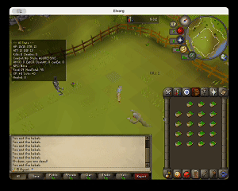
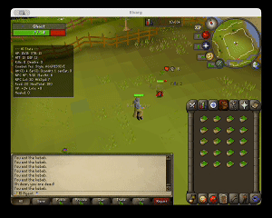
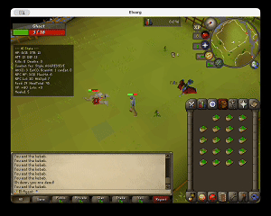

# SARSA RSPS Agent

A reinforcement learning agent that learns to fight NPCs in a RuneScape Private Server (RSPS) from scratch — no rules, no scripts, just trial and error. Built in Java with a handwritten neural network and the SARSA algorithm, the agent goes from dying on its first encounter to consistently winning fights by episode 4000.

[](https://youtu.be/FOudH_oC67U)

> **Watch the full 2-minute training progression** — from Episode 1 through Episode 5000. The video walks through key milestones at Ep 1, 200, 750, 1000, 1500, 2500, 4000, and 5000.

---

## Before & After

| Episode 1 — Agent dies immediately | Episode 4000 — Agent survives intense combat |
|:---:|:---:|
|  |  |

**Generalized eating behavior — the agent learned *when* to eat, not just *that* it should eat:**

<p align="center">
  
</p>

> The eating policy transferred to multi-NPC scenarios without any retraining. The agent learned a general "eat when HP is low" strategy rather than memorizing specific fight sequences.

---

## Table of Contents

- [Motivation](#motivation)
- [How It Works](#how-it-works)
- [Architecture](#architecture)
- [State Representation](#state-representation)
- [Action Space & Masking](#action-space--masking)
- [Reward Design](#reward-design)
- [Neural Network](#neural-network)
- [Training Pipeline](#training-pipeline)
- [Imitation Learning](#imitation-learning)
- [Results](#results)
- [Project Structure](#project-structure)
- [Tech Stack](#tech-stack)
- [Running the Project](#running-the-project)

---

## Motivation

I wanted to see if a simple RL agent could learn something that feels intuitive to human players, knowing when to attack, when to eat, and when to just wait. RuneScape combat has tick-based timing, cooldowns, and resource management (limited food), which makes it a surprisingly interesting environment for reinforcement learning. The goal was never to build a bot — it was to see what emerges when you give a tiny neural network 5,000 fights and a simple reward signal.

---

## How It Works

The agent communicates with a RuneScape private server through a REST API. Each game tick, it observes the world state (player HP, NPC HP, inventory, combat flags), picks an action, and receives a reward based on whether it killed the NPC or died trying. Over thousands of episodes, SARSA updates teach the neural network which actions lead to better outcomes in which situations.

```
Game Server (RSPS)  ←—  REST API  —→  SARSA Agent
   localhost:8081           ↕              ↕
   (game state)        JSON over HTTP   TinyQNetwork
   (execute action)                     (20 → 16 → 3)
```

---

## Architecture

```
┌──────────────────────────────────────────────────┐
│  SarsaRspsAgent                                  │
│  Training loop, episode management, reward calc  │
│  Best-model checkpointing & auto-reload          │
└──────────────────┬───────────────────────────────┘
                   │
┌──────────────────▼───────────────────────────────┐
│  State / Action Layer                            │
│  StateTransformer — API JSON → 20-feature vector │
│  GameActionExecutor — action index → API call    │
│  Action masking — prevents impossible actions    │
└──────────────────┬───────────────────────────────┘
                   │
┌──────────────────▼───────────────────────────────┐
│  TinyQNetwork                                    │
│  Handwritten feedforward neural network          │
│  20 inputs → 16 hidden (tanh) → 3 Q-values      │
│  Xavier init, semi-gradient SARSA updates        │
│  JSON model export/import                        │
└──────────────────────────────────────────────────┘
```

---

## State Representation

The agent sees the game world as a 20-dimensional feature vector, normalized to [0, 1]. I spent a fair amount of time deciding what to include — too many features and the tiny network can't learn; too few and it can't make good decisions.

| # | Feature | Normalization | Category |
|---|---------|---------------|----------|
| 1 | HP ratio | currentHp / maxHp | Player |
| 2 | Max HP | / 99 | Player |
| 3 | Strength level | / 99 | Player |
| 4 | Attack level | / 99 | Player |
| 5 | Defence level | / 99 | Player |
| 6 | Session XP | log-scaled, cap 50k | Player |
| 7 | Levels gained | / 10 | Player |
| 8 | NPC kill count | / 10 | Combat |
| 9 | Death count | / 10 | Combat |
| 10 | In combat | binary | Combat |
| 11 | NPC last hit | / 99 | Combat |
| 12 | Can attack | binary | Combat |
| 13 | Can eat | binary | Combat |
| 14 | NPC HP ratio | npcHp / npcMaxHp | NPC |
| 15 | NPC max HP | / 99 | NPC |
| 16 | NPC max hit | / 20 | NPC |
| 17 | NPC combat level | / 99 | NPC |
| 18 | NPC attack speed | / 10 | NPC |
| 19 | Food remaining | / 28 | Inventory |
| 20 | Heal amount left | / 560 | Inventory |

I initially included `combatTicks` and `eatTicks` (action cooldown timers) but removed them during experimentation — the binary `canAttack` / `canEat` flags turned out to carry the same signal with less noise.

---

## Action Space & Masking

Three actions, each followed by a 550ms delay (one game tick):

| Index | Action | Description |
|-------|--------|-------------|
| 0 | WAIT | Do nothing — let the game tick pass |
| 1 | ATTACK | Engage the current NPC target |
| 2 | EAT | Consume one food item to restore HP |

**Action masking** prevents the agent from exploring impossible actions. EAT is masked out when the player has no food or when the eat cooldown is active. This made a real difference in training speed — without masking, the agent wastes thousands of steps trying to eat with an empty inventory.

---

## Reward Design

I kept the reward signal simple on purpose. The agent gets:

| Signal | Value |
|--------|-------|
| NPC kill | **+5.0** |
| Player death | **-5.0** |
| Eating at full HP | -0.3 |
| Overhealing (heal > missing HP) | -0.1 |
| Redundant action while blocked | -0.01 |

The small penalties for wasteful eating were important. Without them, the agent would spam EAT constantly — technically it wouldn't die, but it would burn through all its food in the first few ticks. The -0.3 / -0.1 penalties taught it to be conservative with food and only eat when it actually matters.

---

## Neural Network

I wrote the neural network from scratch — no TensorFlow, no PyTorch, no DL4J. Just arrays and math. Partly as a learning exercise, partly because the problem is small enough that a framework would be overkill.

**Architecture:** 20 → 16 → 3 (387 trainable parameters)

- **Hidden layer:** 16 neurons with `tanh` activation
- **Output layer:** 3 linear neurons (one Q-value per action)
- **Initialization:** Xavier uniform
- **Update rule:** Semi-gradient SARSA with TD error clipping [-10, 10]
- **Action selection:** Epsilon-greedy with action masking

The network supports JSON export/import, so I can save checkpoints during training and reload the best-performing weights if performance degrades.

```java
// The core SARSA update — one line of RL theory, a few dozen lines of backprop
double target = terminal ? reward : reward + gamma * predict(sNext, aNext);
double error  = target - predict(s, a);
applySemiGradient(s, a, clip(error, -10, 10), alpha);
```

---

## Training Pipeline

**Hyperparameters:**

| Parameter | Value |
|-----------|-------|
| Episodes | 5,000 |
| Learning rate (α) | 0.01 |
| Discount factor (γ) | 0.99 |
| Exploration rate (ε) | 0.025 |
| Episode termination | 2 kills or 2 deaths |
| Logging window | Every 10 episodes |

**Best-model checkpointing:** The training loop tracks a rolling average reward. If performance drops more than 10.0 below the best recorded average, it automatically reloads the best weights. This saved me from a lot of catastrophic forgetting — the agent would occasionally stumble into a bad policy region, and the auto-reload pulls it right back.

**Logging output** (every 10 episodes):
```
[Ep    200] | avgR=  7.250 | K/D= 1.80 (K=0.18 D=0.10, win=0.64) | avgXP=  3.2
         steps=  8.3 | eat=2.1/ep (invalid=0.0%, atFullHp=4.8%, overeat=9.5%, success=85.7%)
         actions: WAIT=0 ATTACK=32 (ok=30, 93.8%) EAT=21
```

Over 800 model checkpoints are saved to disk during a full training run, capturing the agent's progression from random behavior to competent fighting.

---

## Imitation Learning

Before the pure RL training, I experimented with **behavioral cloning** as a warm-start strategy. The idea was to play a few episodes myself, record the (state, action) pairs, and pre-train the network to mimic my decisions.

**How it works:**

1. Run the interactive player mode — the game renders, and I pick actions via console (`1=WAIT`, `2=ATTACK`, `3=EAT`)
2. Each (state, action) pair gets dumped to a JSON file
3. A separate training pass uses cross-entropy loss to clone my policy into the network
4. The pre-trained weights are loaded as a starting point for SARSA training

It helped the agent skip the "die immediately every episode" phase, but I found that pure SARSA from scratch reached comparable performance within a few hundred episodes anyway. The behavioral cloning was still a valuable experiment — it showed that the state representation was expressive enough for a human policy to be captured by the network.

---

## Results

The best model reached an **average reward of 9.712** over a 10-episode window after 5,000 training episodes. To put that in context — the theoretical maximum for 2 kills and 0 deaths is 10.0, so the agent is winning almost every fight with minimal wasted actions.

**Key observations from training:**

- **Ep 1–200:** Random exploration. Lots of dying. Occasionally stumbles into a kill.
- **Ep 200–750:** Learns that ATTACK is generally good. Still doesn't eat.
- **Ep 750–1500:** Discovers eating. Initially eats too much (spam-eat phase).
- **Ep 1500–3000:** Refines eating policy. Learns to eat only when HP is low.
- **Ep 3000–5000:** Stable, high-performance policy. Wins consistently.

The eating behavior is what I'm most proud of. The agent learned a general policy — "eat when HP is low and food is available" — that transfers to scenarios it was never trained on (like multi-NPC fights). It didn't memorize fight patterns; it learned the underlying concept.

---

## Project Structure

```
sarsa-rsps-agent/
├── pom.xml
├── src/main/java/
│   ├── ann/
│   │   └── TinyQNetwork.java          # Neural network (from scratch)
│   └── sara/
│       ├── SarsaRspsAgent.java         # Main training loop
│       ├── SarsaRspsAgentPlayer.java   # Interactive & imitation modes
│       ├── model/
│       │   ├── State.java              # 20-feature state representation
│       │   ├── Actions.java            # Action definitions
│       │   ├── StateReward.java        # State-reward pair
│       │   └── EpisodeStats.java       # Per-episode metrics
│       └── client/
│           ├── GameApiClient.java      # REST API client (HttpClient)
│           ├── GameActionExecutor.java # Action → API call mapping
│           ├── StateTransformer.java   # JSON → State conversion
│           └── dto/                    # Data transfer objects
│               ├── GameStateResponse.java
│               ├── PlayerDto.java
│               ├── CombatDto.java
│               ├── NpcCombatDto.java
│               ├── InventoryDto.java
│               └── ...
└── src/main/resources/
    └── ann/
        ├── best/                       # Best-performing model weights
        ├── run/                        # Training checkpoint history (800+)
        └── imitation/                  # Behavioral cloning models
```

---

## Tech Stack

| Technology | Purpose |
|------------|---------|
| **Java 17** | Core language |
| **Spring Boot 3.2** | Application framework & dependency management |
| **Maven** | Build system |
| **JUnit 5** | Test harness for training execution |
| **REST Assured 5.3** | HTTP client for game API communication |
| **Jackson** | JSON serialization for model weights & state data |
| **Lombok** | Boilerplate reduction |

No ML frameworks. The neural network, backpropagation, SARSA updates, behavioral cloning, and action selection are all implemented from scratch.

---

## Running the Project

**Prerequisites:**
- Java 17+
- Maven 3.8+
- A running RSPS game server with the REST API exposed on `localhost:8081`

**Train the agent:**
```bash
mvn test -Dtest=SarsaRspsAgent#executeSarsa
```

**Interactive play (human-in-the-loop):**
```bash
mvn exec:java -Dexec.mainClass="sara.SarsaRspsAgentPlayer"
```

**Train from imitation data:**
```bash
mvn test -Dtest=SarsaRspsAgentPlayer#trainFromImitationDataAndExport
```

Model checkpoints are saved to `src/main/resources/ann/` with filenames encoding the architecture, average reward, and episode number:
```
ann_20260319_151430_20in_16n_3out_avgR9.712_ep5000.json
```

---

## License

This is a personal project built for learning and experimentation.
